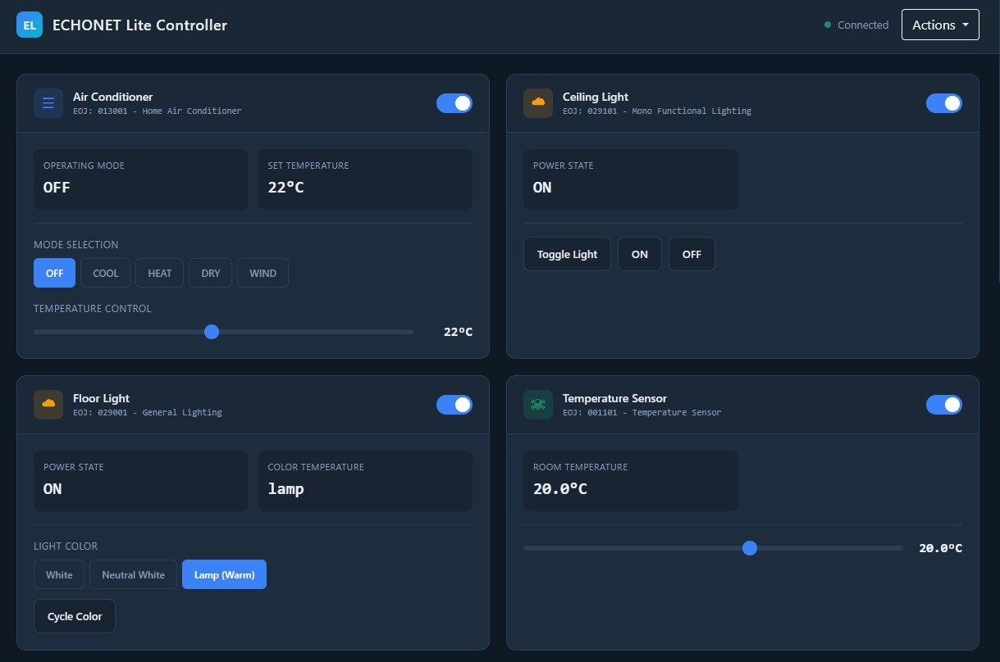

# echonet-lite-kaden-emulator

[](LICENSE)
[](https://github.com/scottyphillips/echonet-lite-kaden-emulator/actions/workflows/action.yml)
[](https://hub.docker.com/r/scottyphillips/echonet-lite-kaden-emulator)

An ECHONET Lite emulator that controls virtual home appliances.

## Description

This emulator allows you to control virtual devices via a web browser and expose their state using the UDP-based ECHONET Lite protocol. You can also control these virtual devices through ECHONET Lite commands sent over UDP.



### Supported Devices

| Device | ECHONET Lite Class | EOJ Code |
|--------|-------------------|----------|
| Ceiling Light (Single-function Lighting) | 0x0291 | 0x029101 |
| Temperature Sensor | 0x0011 | 0x001101 |
| Humidity Sensor | 0x0012 | 0x001201 |
| Human Detection Sensor (Motion) | 0x0007 | 0x000701 |
| Floor Light (General Lighting) | 0x0290 | 0x029001 |
| Electric Shutter/Blind | 0x0263 | 0x026301 |
| Electric Lock + Door | 0x026F / 0x05FD | 0x026F01 / 0x05FD01 |
| Switch (JEM-A / HA Terminal) | 0x05FD | 0x05FD01 |
| Electric Water Heater (EcoCute) | 0x026B | 0x026B01 |
| Home Air Conditioner | 0x0130 | 0x013001 |

This emulator follows the [ECHONET Device Object Specification Release P](https://echonet.jp/spec_object_rp/) for ECHONET Lite compliance. While we have implemented the required properties, only basic functionality is supported for each device type.

> **Note:** The well-known [MoekadenRoom](https://github.com/SonyCSL/MoekadenRoom) by Sony is another ECHONET Lite emulator. This project was created separately because MoekadenRoom uses an older specification and didn't include the specific devices needed for this project.

## Features

- **ECHONET Protocol Compatibility**: Full TID preservation, response aggregation (OPC), and INF notification support
- **Pychonet Compatible**: Tested and verified working with [pychonet](https://github.com/michmich37/pychonet) Python library
- **Web UI**: Browser-based control interface for all supported devices
- **REST API**: HTTP endpoints for device status queries and state changes
- **Plugin Architecture**: Extensible design allowing new device types to be added as plugins
- **Multi-Device Configuration**: Enable/disable individual devices via configuration file

## Usage

### Running with Docker

**Requirements:** Docker (version 20+ recommended)

#### Option 1: Expose ECHONET Lite on the host network

```bash
docker run -d --net=host banban525/echonet-lite-kaden-emulator:latest
```

Use this method when you want to run the emulator on a PC that acts as an ECHONET Lite node on your network. Note that only one ECHONET Lite node can operate per IP address.

#### Option 2: Expose ECHONET Lite inside Docker's network

```bash
docker run -d -p 3000:3000 banban525/echonet-lite-kaden-emulator:latest
```

Use this method when running multiple emulator nodes on a single machine (each container needs different port mappings).

#### Access the Web UI

After starting, open your browser to `http://<server-ip>:3000/`

### Running with Node.js

**Requirements:** Node.js (version 14+ recommended)

```bash
# Clone the repository
git clone <repository-url>
cd echonet-lite-kaden-emulator

# Install dependencies (first time only)
npm install

# Start the server
npm start

# Open browser to http://localhost:3000/

# Stop with Ctrl+C
```

## Environment Variables

| Variable | Description | Default |
|----------|-------------|---------|
| `ECHONET_TARGET_NETWORK` | Target network in CID notation (e.g., `192.168.1.0/24`) to bind ECHONET Lite traffic. Auto-detected if not specified. | Auto-detect IPv4 |
| `ECHOENT_DELAY_TIME` | Response delay in milliseconds (simulates slow devices) | 0 (no delay) |
| `WEBPORT` | Port for the web UI and REST API | 3000 |
| `SETTINGS` | Path to configuration file | - |
| `DEBUG` | Enable debug logging (`TRUE` or `1`) | false |

## Configuration File

The configuration file allows enabling/disabling individual devices and setting custom Node Profile IDs.

```json
{
  "nodeProfile": {
    "manufacturer": "TestLab",
    "manufacturerName": "Test Laboratory",
    "productCode": "0x54 0x45 0x53 0x54",
    "uid": "fe000000000000000000000000000001"
  },
  "network": {
    "targetNetwork": "",
    "delayTime": 0,
    "webPort": 3000
  },
  "devices": {
    "monoFunctionalLighting": {
      "disabled": false,
      "id": ""
    },
    "temperatureSensor": {
      "disabled": false,
      "id": ""
    },
    "humiditySensor": {
      "disabled": false,
      "id": ""
    },
    "humanDetectionSensor": {
      "disabled": false,
      "id": ""
    },
    "generalLighting": {
      "disabled": false,
      "id": ""
    },
    "electricallyOperatedRainSlidingDoorShutter": {
      "disabled": false,
      "id": ""
    },
    "electricLock": {
      "disabled": false,
      "id": ""
    },
    "switch": {
      "disabled": false,
      "id": ""
    },
    "electricWaterHeater": {
      "disabled": true,
      "id": ""
    },
    "homeAirConditioner": {
      "disabled": false,
      "id": ""
    }
  }
}
```

### Configuration Options

| Field | Description |
|-------|-------------|
| `nodeProfile.uid` | Custom Node Profile ID (must start with `fe`, 34 hex characters) |
| `devices.<type>.disabled` | Set to `true` to disable this device type |
| `devices.<type>.id` | Custom EOJ identifier (leave empty for auto-generated) |

## REST API Endpoints

| Method | Endpoint | Description |
|--------|----------|-------------|
| GET | `/api/status` | Get all device statuses |
| GET | `/api/cellingLight` | Get ceiling light status |
| POST | `/api/cellingLight` | Set ceiling light state |
| GET | `/api/sensorMeter` | Get temperature/humidity sensor status |
| POST | `/api/sensorMeter` | Set sensor values |
| GET | `/api/motionSensor` | Get motion sensor status |
| POST | `/api/motionSensor` | Set motion detection state |
| GET | `/api/floorLight` | Get floor light status |
| POST | `/api/floorLight` | Set floor light state |
| GET | `/api/shutter` | Get shutter status |
| POST | `/api/shutter` | Set shutter position |
| GET | `/api/door` | Get door/lock status |
| POST | `/api/door` | Set door/lock state |
| GET | `/api/bathWaterHeater` | Get bath water heater status |
| POST | `/api/bathWaterHeater` | Set bath water heater state |
| GET | `/api/airConditioner` | Get air conditioner status |
| POST | `/api/airConditioner` | Set air conditioner state |

## Third-Party Usage

- Images used in the application are from [irasutoya.com](https://www.irasutoya.com/) (Irasutoya) - Illustration library.

## License

[MIT](LICENSE)

## Author

- Original project: [banban525](https://github.com/banban525/echonet-lite-kaden-emulator)
- Current maintainer: [scottyphillips](https://github.com/scottyphillips/echonet-lite-kaden-emulator)
- Modernization and plugin architecture: [scottyphillips](https://github.com/scottyphillips)